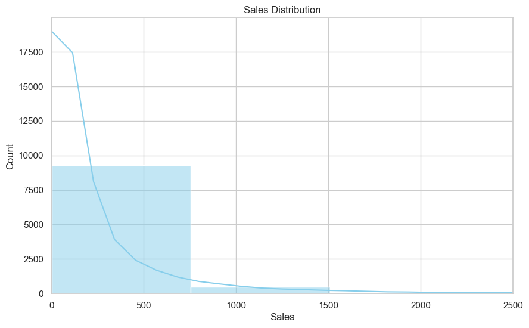

# Retail Insights

The dataset contains sales, profit, and customer data across various regions, product categories, and customer segments. The business focuses on retail operations, highlighting trends in sales, profitability, and shipping efficiency. This analysis aims to optimize profitability, improve customer satisfaction, and enhance operational efficiency by addressing key challenges and opportunities.

## Goal

The goal of this project is to examine sales, profit, and customer behavior to identify trends and insights that drive profitability and operational efficiency. The objective is to uncover key factors impacting performance and provide data-driven recommendations for improvement.

## Approach

- **Cleaned and analyzed data in SQL** to create new metrics such as shipping delays and profit margins, enhancing data quality.
- **Performed exploratory data analysis (EDA) in Python**, using visualizations like bar graphs, histograms, and heatmaps to extract actionable insights.
- **Summarized findings in Excel** and designed an interactive **Tableau dashboard** to visualize trends and performance.

## Findings

## Key Insights and Visualizations

### 1. Most transaction are in lower sales range

- The majority of sales transactions appear to be under 200 units
- Few High value sales outliers are presents
- **Recommendations**: Focus on inventory and pricing strategies for high-value products.

### 2. Seasonal Spike In Sales

- Sales peak in March, September, and October, averaging $77,000 during these months (2016-2017), driven by seasonal promotions.
- **Recommendation:** Leverage promotional events to further drive sales during peak months.

### 3. Canon Camera has the highest sales

- Canon Camera dominates with 25% of top 10 product sales
- Top 30 products account for 21% of total revenue
- Revenue heavily concentrated in few key products
- **Recommendation**:  Prioritize inventory and marketing for high-performing products.

### 4. Profit margins vary significantly at higher sales levels

- 80% transactions generate positive profits values
- Some outliers show significant losses, particularly concerning for high-value sales
- **Recommendation**: Investigate cases of negative profits, especially in high-value sales

### 5. Majority Of Profits Are Small Positive values

- 18% transactions generate negative profits.
- **Recommendation**: Evaluate pricing strategies and investigate reasons for negative profits.

### 6. Most orders consist of 1–3 items

- 48% of orders contain 2-3 items per order
- Few large order outliers.
- **Recommendation**: Ensure that small quantity items are well-stocked while also identifying potential upsell opportunities for large orders.

### 7. Most orders are shipped within 1–5 days

- 47% of orders have a shipping time of 4-5 days
- Small percentage facing delays longer than 7 days.
- **Recommendation**: Investigate reasons for delays and take steps to improve shipping efficiency.

### 8. The West region performs best in terms of profits

- Home Office segment underperforms in some regions.
- West region generates the highest profits.
- **Recommendation**: Focus on strategies to improve profitability in underperforming regions and segments.

### 9. Strong negative correlation between discount rates and profit margins

- Sales and profit are positively correlated.
- Discounts lower profit margins significantly.
- **Recommendation**: Evaluate discounting strategies to improve profit margins.

### 10. Consumer segment dominates with 52% of total sales

- Home Office segment contributes 18% of revenue
- Corporate segment follows at 30% market share
- Consumer segment dominates with 52% of total sales
- **Recommendation:** Focus marketing efforts on growing Consumer segment while developing targeted strategies to boost Home Office sales.

## Business Questions

1. Which regions are driving the highest sales, and are they also the most profitable?
2. Which product categories and sub-categories are the most profitable, and which ones incur losses?
3. How do customer segments (Consumer, Corporate, Home Office) differ in terms of sales, profit, and discount utilization?
4. What is the impact of discounts on profit? Is there a threshold beyond which discounts negatively affect profitability?
5. Does shipping delay impact profit or customer segments differently across regions?
6. Are there specific months or seasons where sales and profit peak?